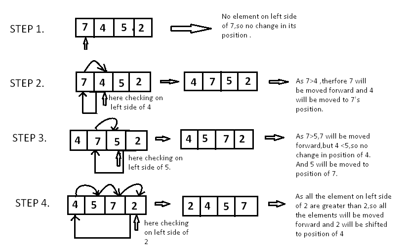
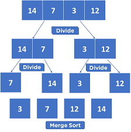
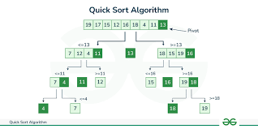

# Sort Alogrithms


## Table of Contents

1. [Definition of Sort](#Sort)
2. [Stability](#Stability)
3. [Selection Sort](#Selection-Sort)
4. [Insertion Sort](#Insertion-Sort)
5. [Shell Sort](#Shell-Sort)
6. [Merge Sort](#Merge-Sort)
7. [Quick Sort](#Quick-Sort)

---

## Sort
- A sorting algorithm is a method or procedure used to arrange a collection of items or data elements into a specific order, typically in ascending or descending order based on some defined criteria. 
- These criteria can vary depending on the context, such as numerical values, alphabetic characters, or custom-defined rules.

## Stability
-  A sorting algorithm is said to be stable if it preserves the relative order of equal elements in the sorted output as they were in the original input.
- Stability is important in applications where the original order of equal elements matters.

## Selection Sort
- A sort algorithm which works by repetitively selecting the smallest (or largest) element from the unsorted portion of the list and moves it to the end of the sorted portion.
 - Has linear time complexity 𝑂(𝑛2) in both cases and space complexity of 𝑂(1)
 - It is unstable sort


    ### Steps
    1. Find the smallest value in the list
    2. Switch it with the value in the first position
    3. Find the next smallest value in the list
    4. Switch it with the value in the second position
    5. Repeat until all values are in their proper places

```java
    public static void selectionSort(int[] array) {
        int n = array.length;

        // Iterate over each element of the array
        for (int i = 0; i < n - 1; i++) {
            // Assume the current position is the smallest
            int minIndex = i;

            // Find the index of the smallest element in the unsorted part of the array
            for (int j = i + 1; j < n; j++) {
                if (array[j] < array[minIndex]) {
                    minIndex = j;
                }
            }

            // Swap the found minimum element with the first element of the unsorted part
            int temp = array[minIndex];
            array[minIndex] = array[i];
            array[i] = temp;
        }
    }
```
### Diagramatic Representation
   


| Sorted Sublist       | Unsorted Sublist        | Least Element in Unsorted List |
|----------------------|-------------------------|--------------------------------|
| ()                   | (11, 25, 12, 22, 64)    | 11                             |
| (11)                 | (25, 12, 22, 64)        | 12                             |
| (11, 12)             | (25, 22, 64)            | 22                             |
| (11, 12, 22)         | (25, 64)                | 25                             |
| (11, 12, 22, 25)     | (64)                    | 64                             |
| (11, 12, 22, 25, 64) | ()                      |                                |


## Insertion Sort
- A sorting algorithm that works by repetitively taking an unsorted element and inserting it into its correct position within a sorted subset of the list.
- Stable; i.e., does not change the relative order of elements with equal keys
- In-place; i.e., only requires a constant amount O(1) of additional memory space
- Efficient for quite small dataset
- Adaptive, i.e., efficient for data sets that are already substantially sorted: the time
- Best Case Time Complexity: O(n)
- Average Case Time Complexity: O(n^2)
- Worst Case Time Complexity: O(n^2)
- Space Complexity: 𝑂(1)

    ### Steps
    1. Initialize: Start with the first element, assuming it is already sorted.
    2. Insert: Take the next element and scan the sorted part of the array from right to left to find its correct position.
    3. Shift and Place: Shift all larger elements in the sorted part to the right to make space for the new element, and insert the element in its correct position.
    4. Repeat: Repeat the process for all elements in the array.

    ```java
     public static void insertionSort(int[] array) {
        int n = array.length;

        for (int i = 1; i < n; i++) {
            int key = array[i];
            int j = i - 1;

            // Move elements of array[0..i-1] that are greater than key
            // to one position ahead of their current position
            while (j >= 0 && array[j] > key) {
                array[j + 1] = array[j];
                j = j - 1;
            }
            array[j + 1] = key;
        }
    }

    ```
    
    ### Diagramatic Representation
    

## Shell Sort
-  An optimization of insertion sort that allows the exchange of far-apart elements, reducing the overall number of swaps and comparisons needed to sort the list.
- An in-place comparison sort with space complexity 𝑂(1).
- Not stable
- Fastest of all O(n2) sorting algorithms.

## Merge Sort
- A divide-and-conquer algorithm that sorts an array by first breaking it down into smaller arrays, and then building the array back together the correct way so that it is sorted.
- It is stable
- Has consistent time complexity 𝑂(𝑛log⁡𝑛) 
- Space complexity 𝑂(𝑛)

    ### Steps
    1. Divide the unsorted array into two sub-arrays, half the size of the original.
    2. Continue to divide the sub-arrays as long as the current piece of the array has more than one element.
    3. Merge two sub-arrays together by always putting the lowest value first.
    4. Keep merging until there are no sub-arrays left

    ```java
      public static void mergeSort(int[] arr) {
        if (arr == null || arr.length <= 1) {
            return; // Array is already sorted or empty
        }
        int[] temp = new int[arr.length];
        mergeSort(arr, temp, 0, arr.length - 1);
    }

    private static void mergeSort(int[] arr, int[] temp, int left, int right) {
        if (left < right) {
            int mid = left + (right - left) / 2; // Calculate the middle index
            mergeSort(arr, temp, left, mid); // Sort left half
            mergeSort(arr, temp, mid + 1, right); // Sort right half
            merge(arr, temp, left, mid, right); // Merge the sorted halves
        }
    }

    private static void merge(int[] arr, int[] temp, int left, int mid, int right) {
        // Merge implementation remains the same
    }
    ```
    ### Diagramatic Representation
    

## Quick Sort
- Quick sort is a highly efficient sorting algorithm that uses the divide-and-conquer strategy to sort an array or list of elements.
- Not stable
- In place O(logn)
- Good for large datasets
- Worst case of 𝑂(𝑛2) when the pivot element is either the highest or lowest value in every sub-array(poor pivot)
- Average case 𝑂(𝑛log⁡𝑛)

    ### Steps
    1. Divide and Partition: Choose a pivot element and rearrange the elements so that all elements smaller than the pivot are moved to its left, and all elements greater than the pivot are moved to its right. This step is usually implemented using the "partition" function.
    2. Recursively Sort Sub-arrays: Recursively apply the quick sort algorithm to the sub-arrays formed by the partitioning process. These sub-arrays are sorted independently of each other.
    3. Base Case: The recursion stops when the sub-arrays become sufficiently small (e.g., contain only one element), as single-element arrays are considered sorted by definition.

    ```java
       public static void quickSort(int[] arr, int low, int high) {
        if (low < high) {
            // Partition the array, and get the pivot index
            int pivotIndex = partition(arr, low, high);

            // Recursively sort the sub-arrays
            quickSort(arr, low, pivotIndex - 1);
            quickSort(arr, pivotIndex + 1, high);
        }
    }

    private static int partition(int[] arr, int low, int high) {
        // Choose the rightmost element as the pivot
        int pivot = arr[high];
        int i = low - 1; // Index of smaller element

        for (int j = low; j < high; j++) {
            // If current element is smaller than the pivot
            if (arr[j] < pivot) {
                i++;

                // Swap arr[i] and arr[j]
                int temp = arr[i];
                arr[i] = arr[j];
                arr[j] = temp;
            }
        }

        // Swap arr[i+1] and arr[high] (or the pivot)
        int temp = arr[i + 1];
        arr[i + 1] = arr[high];
        arr[high] = temp;

        return i + 1;
    }
    ```
    ### Diagramatic Representation
    
